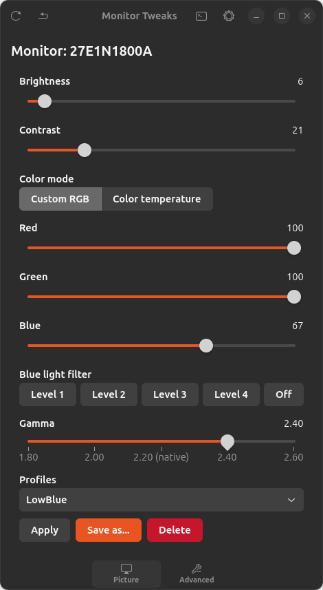
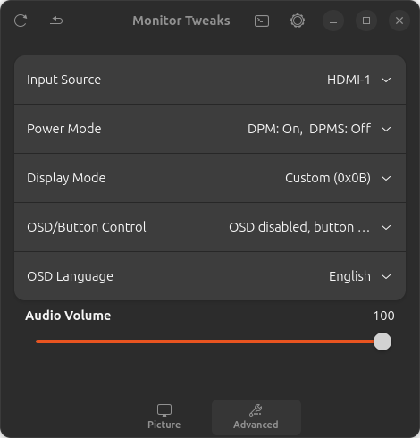
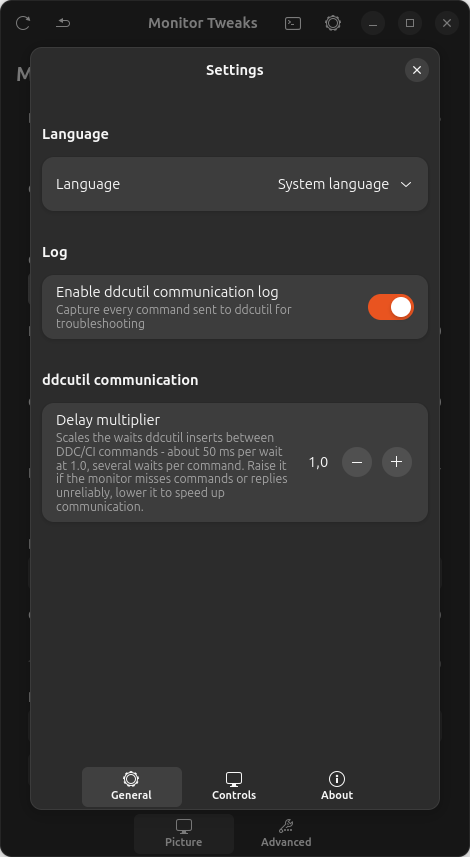

# Monitor Tweaks

Real hardware control (DDC/CI, via [ddcutil](https://www.ddcutil.com/))
of your monitor's brightness, contrast, gamma, color and other
functions, for Ubuntu/GNOME. No software simulation: every command
actually talks to the monitor over the I2C bus, exactly like its
physical buttons or OSD menu would.

## Screenshots

<p>
  
  
  
</p>

## What the package installs

- **`/usr/bin/monitor-tweaks`** — the full GTK4/Adwaita app, with two
  tabs:
  - **Picture**: brightness, contrast, color mode (custom RGB or
    color temperature with Day/Night presets), blue light filter (4
    levels), gamma, savable profiles.
  - **Advanced**: input source (HDMI/DisplayPort), power mode,
    display mode, monitor speaker volume, OSD/button control, OSD
    language — only the entries the connected monitor actually
    declares support for (read from its real DDC/CI capabilities, not
    assumed).
- **GNOME Shell extension** — a top-right panel icon with a
  collapsible quick panel (brightness, contrast, gamma, RGB, profiles)
  for on-the-fly adjustments without opening the full app.
- **Application menu entry** ("Monitor Tweaks").

### Other features

- **Profiles**: save/apply/delete named combinations of values, per
  monitor (profiles from one monitor never mix with another's if you
  have more than one connected).
- **Multi-monitor support**: if more than one DDC/CI display is
  connected, a selector lets you pick which one to control; profiles
  and settings stay separate per monitor (identified by
  manufacturer:model:serial, not by which port it's plugged into).
- **Display autoswitch** (optional, from Settings → General):
  automatically switch to your preferred external monitor at login,
  falling back to the internal panel when it's not connected. Build a
  priority-ordered list of outputs and a Mode (Extend / Mirror / One
  at a time); works on both X11 (`xrandr`) and Wayland (Mutter's
  `org.gnome.Mutter.DisplayConfig` D-Bus API), auto-detected from the
  session type. Includes optional portrait rotation for the primary
  output.
- **Log window** (optional, from Settings): shows every command sent
  to `ddcutil`, with its response and outcome — exportable to a file,
  useful for figuring out why a monitor isn't responding or behaves
  unexpectedly.
- **Communication delay multiplier**: adjustable from Settings for
  monitors with a slow or unreliable DDC/CI implementation
  (equivalent to ddcutil's `--sleep-multiplier`).
- **24 EU languages + Russian**, auto-detected from the system
  language or selectable manually.

## Download

Grab the latest `.deb` from this repository's
[Releases](../../releases) page.

## Requirements

- Ubuntu with GNOME Shell 46 or newer (for the extension; the GTK app
  on its own also works on other GTK-compatible desktops).
- A monitor connected via DisplayPort/HDMI that supports DDC/CI (may
  need enabling in the monitor's OSD menu — not all monitors have it
  on by default).
- `apt` resolves software dependencies on its own (`ddcutil`, GTK4 >=
  4.10, libadwaita >= 1.5); I2C hardware access works out of the box
  thanks to the udev rule shipped with the `ddcutil` package itself —
  no need to add the user to any group or configure permissions by
  hand.

## Installation

```sh
sudo apt install ./monitor-tweaks_*.deb
```

(`apt` automatically downloads missing dependencies; alternatively
`sudo dpkg -i ./monitor-tweaks_*.deb && sudo apt -f install`.)

## Enabling the extension (one manual step)

System packages can't enable GNOME Shell extensions on the user's
behalf — it's a per-user action, needed only once after install:

1. Restart GNOME Shell:
   - **X11**: `Alt+F2`, type `r`, Enter.
   - **Wayland**: requires logging out and back in.
2. Enable the extension either way:
   - **Extensions** app → "Monitor Tweaks" → toggle on.
   - From a terminal: `gnome-extensions enable monitor-tweaks@local`

The icon appears in the top-right corner of the panel.

## Quick check

```sh
ddcutil detect --brief
```

Should list at least one `Display 1`. If nothing shows up:
- make sure the monitor is connected via DisplayPort/HDMI (won't work
  over purely software/VNC display outputs, or through USB-C
  hubs/adapters that don't pass through the DDC/CI channel);
- enable "DDC/CI" in the monitor's OSD menu;
- check that the `i2c-dev` kernel module is loaded:
  `lsmod | grep i2c_dev` (if missing: `sudo modprobe i2c-dev`);
- if the monitor responds slowly or intermittently, try raising the
  "Delay multiplier" in the app's Settings.

## Updates

The app includes an on-demand update check (About panel in
Settings) that compares the installed version against the latest one
published on this repository. There's no auto-update: a new version
always has to be downloaded and installed manually from here.

## Uninstallation

```sh
sudo apt remove monitor-tweaks
```

## Privacy

The app makes no network calls during normal use: all communication
(`ddcutil`) stays local, between the computer and the monitor over
I2C. The only possible network connection is the explicit, on-demand
update check described above, to GitHub's public API.

## Third-party

The GTK4 app doesn't bundle any third-party library. GTK4, libadwaita and
PyGObject are dynamically linked against the system's own copy (installed
separately via `apt`); `ddcutil` is invoked as a standalone external
command (`subprocess`), never linked. Neither case imposes a license
obligation on the app's own code.

| Component | License | How it's used |
|---|---|---|
| GTK4 | LGPL-2.1-or-later | Dynamically linked (system library) |
| libadwaita | LGPL-2.1-or-later | Dynamically linked (system library) |
| PyGObject | LGPL-2.1-or-later | Dynamically linked (system library) |
| ddcutil | GPL-2.0-or-later | Invoked as an external process |

The **GNOME Shell extension is a different situation**: unlike the app, it
doesn't run as its own process — it's loaded and executed directly inside
`gnome-shell`'s own process (GPL-2.0-or-later), using its internal GJS
APIs. That's a closer relationship than dynamic linking, which is why
GNOME Shell extensions are conventionally published under
GPL-2.0-or-later to match the process they run in. This project doesn't
formally license the extension that way yet (see [License](#license)
below) — noted here as something worth revisiting.

## License

Personal project, no formal license.
